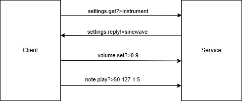

# PYNQ Audio Synth Service (Benternet + ZMQ)

This project implements a real-time audio synthesizer running on a PYNQ board. It communicates over **ZMQ** using the **Benternet** message style, allowing external clients to trigger sound generation with clean, network-based messaging.

---

## Features

- C++ audio synth core on PYNQ (waveform generation, ADSR, instrument switching)
- ZMQ + Benternet-style message parsing
- Supports note playing, chord playing, instrument switching, and envelope shaping
- Heartbeat service for system monitoring
- Fully object-oriented C++ design

---

## Message API

[API](Documentation/API.md)

---

## Heartbeat

The service sends `status.reply!>alive` every 5 seconds to confirm it’s still running and responsive.

---

## Example structure

